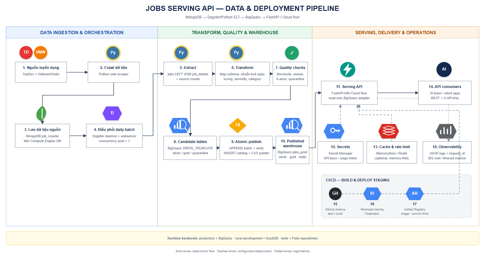

# Jobs Serving API

> **Chuẩn bị thuyết trình Data Engineering:** xem ngay
> [Mục 15 — Bằng chứng năng lực Data Engineering](#15-bằng-chứng-năng-lực-data-engineering).

Jobs Serving API là dịch vụ **chỉ đọc** cung cấp dữ liệu tin tuyển dụng đã được chuẩn hoá cho
team AI và các hệ thống nội bộ. Luồng production của project là:

```text
TopDev / VietnamWorks
        │
        ▼
Crawler (repo khác) → MongoDB `job_crawler`
        │
        ▼
Dagster điều phối (repo khác)
        │ gọi CLI của repo này
        ▼
Python ELT: Extract → Transform → Quality gate → Atomic publish
        │
        ▼
BigQuery: silver + gold + batch metadata
        │
        ▼
FastAPI trên Cloud Run → AI client / người dùng nội bộ
```



Tài liệu này giải thích pipeline theo đúng thứ tự chạy, file/folder tham gia ở từng bước, mục đích
của từng bước và cách vận hành local, staging, production. Sơ đồ chỉnh sửa được nằm tại
[`docs/architecture/jobs-serving-api-pipeline.drawio`](docs/architecture/jobs-serving-api-pipeline.drawio).

> **Trạng thái hiện tại:** source code hỗ trợ ba backend đọc: `fake` cho demo/test, `duckdb` cho
> phát triển local và `bigquery` cho staging/production. Việc kết nối MongoDB/BigQuery thật phụ
> thuộc credential và hạ tầng của môi trường, không được unit test tự động xác nhận.

---

## 1. Khái niệm và phạm vi

| Khái niệm           | Hiểu đơn giản                                                             |
| ------------------- | ------------------------------------------------------------------------- |
| **Crawler**         | Thu thập tin từ TopDev/VietnamWorks và lưu dữ liệu thô vào MongoDB.       |
| **ELT**             | Extract từ MongoDB, transform bằng Python, rồi load/publish vào BigQuery. |
| **Silver**          | Một dòng sạch cho một job, đủ nhỏ và an toàn để API tìm kiếm.             |
| **Gold**            | Chỉ số thị trường đã tổng hợp sẵn, tránh tính median trên mỗi request.    |
| **Quarantine**      | Record lỗi/thiếu dữ liệu; không được phục vụ qua API.                     |
| **Batch**           | Một snapshot dữ liệu bất biến của một lần ELT, nhận diện bằng `batch_id`. |
| **Current pointer** | Con trỏ trong `warehouse_state` cho biết batch API đang phục vụ.          |
| **Candidate table** | Bảng làm việc tạm trước khi publish.                                      |
| **Atomic publish**  | Dữ liệu, catalog và current pointer cùng thành công hoặc cùng rollback.   |

Repo này **có** CLI ELT, các phép chuẩn hoá, quality checks, BigQuery writer/read adapter, FastAPI,
Docker, script hạ tầng GCP và CI/CD. Repo này **không có** code crawler và code Dagster. Trong kiến
trúc tổng thể, Dagster đợi crawler hoàn tất rồi gọi
`python -m app.elt.serving.run_serving_elt` của repo này.

---

## 2. Pipeline dữ liệu MongoDB → BigQuery

Entry point hiện hành là `app/elt/serving/run_serving_elt.py`. Một run đi qua các bước sau.

### Bước 0 — Crawler ghi dữ liệu nguồn

| Nội dung             | Chi tiết                                          |
| -------------------- | ------------------------------------------------- |
| Nơi thực hiện        | Repo crawler/orchestration khác                   |
| Đầu vào              | Website TopDev và VietnamWorks                    |
| Đầu ra               | MongoDB database `job_crawler`                    |
| Collections ELT dùng | `jobs`, `job_details`, `job_categories`           |
| Mục đích             | Giữ dữ liệu crawl trước khi chuẩn hoá cho serving |

`jobs` chứa bản ghi danh sách, `job_details` chứa chi tiết đã crawl và `job_categories` là fallback
cho category. Pipeline hiện chỉ nhận `platformId` là `topdev` hoặc `vietnamworks`.

### Bước 1 — Dagster kích hoạt batch

| Nội dung      | Chi tiết                                                 |
| ------------- | -------------------------------------------------------- |
| Nơi thực hiện | Repo orchestration khác                                  |
| File được gọi | `app/elt/serving/run_serving_elt.py`                     |
| Lineage       | `--batch-id`, `--crawl-batch-id`, `--dagster-run-id`     |
| Mục đích      | Chạy sau crawler, tránh chạy chồng và truy vết nguồn gốc |

CLI tự sinh `batch_id` theo UTC nếu không truyền. Môi trường được điều phối nên truyền cả crawl batch
và Dagster run ID để có thể điều tra ngược.

### Bước 2 — Writer guard chọn đúng đích

| File                                 | Vai trò                                                    |
| ------------------------------------ | ---------------------------------------------------------- |
| `app/elt/serving/targets.py`         | Đọc `JOBS_BQ_*`, allowlist môi trường và phân giải dataset |
| `app/elt/serving/run_serving_elt.py` | Bắt buộc chọn `--environment staging` hoặc `prod`          |

Dataset không được nhận tuỳ ý từ input mà được suy ra theo map cố định:

```text
staging → JOBS_BQ_DATASET_STAGING → mặc định jobs_staging
prod    → JOBS_BQ_DATASET_PROD    → mặc định jobs_prod
```

Mục đích là ngăn ghi nhầm production. `--dataset-suffix _test` chỉ dùng cho integration test. Trước
khi chạm dữ liệu, CLI log rõ environment, project, dataset và location.

### Bước 3 — Extract từ MongoDB

| File                               | Vai trò                                        |
| ---------------------------------- | ---------------------------------------------- |
| `app/elt/serving/extract_mongo.py` | Kết nối, lọc nguồn, join dữ liệu và đếm record |

Luồng extract:

1. Đọc `jobs`, chỉ lấy TopDev và VietnamWorks.
2. Index `job_details` theo `(platformId, externalId)`.
3. Index `job_categories` để làm category fallback.
4. LEFT JOIN job với detail. Job thiếu detail vẫn được giữ để đưa vào quarantine.
5. Đếm số job thực tế theo source cho bước đối soát.

LEFT JOIN giúp record không “biến mất im lặng”. Mỗi job nguồn cuối cùng phải nằm ở **silver hoặc
quarantine**.

### Bước 4 — Map và chuẩn hoá silver

| File                            | Dữ liệu xử lý                                     |
| ------------------------------- | ------------------------------------------------- |
| `app/elt/serving/mapper.py`     | Ghép transform và quyết định silver/quarantine    |
| `app/elt/serving/silver.py`     | `SilverRow`, `QuarantineRecord`, trạng thái parse |
| `app/elt/serving/dates.py`      | Ngày đăng và hạn nộp                              |
| `app/elt/serving/salary.py`     | Lương về VND/tháng                                |
| `app/elt/serving/experience.py` | Kinh nghiệm min/max                               |
| `app/elt/serving/seniority.py`  | Cấp bậc và mapping version                        |
| `app/elt/serving/categories.py` | Category theo source, dạng repeated record        |
| `app/elt/serving/company.py`    | Tên công ty theo cấu trúc từng nguồn              |

Record vào quarantine nếu: thiếu `externalId`; thiếu detail `completed`; thiếu title; không dựng
được ngày đăng từ `postedAt`/`firstSeenAt`; hoặc thiếu URL nguồn.

Record hợp lệ trở thành `SilverRow` với ID `<source>:<external_id>`. Một job là một dòng; categories
nằm trong mảng record thay vì làm nổ job thành nhiều dòng. Điều này giữ phân trang ổn định và tránh
đếm trùng.

Quy tắc đáng chú ý:

- `effective_posted_date` lấy từ `postedAt`, fallback sang `firstSeenAt`;
- lương VND nguồn được hiểu theo triệu VND/tháng và nhân `1_000_000`;
- lương USD dùng giả định cố định `1 USD = 25.500 VND` để có thể tái lập;
- giữ giá trị gốc, currency, period, tỷ giá và version quy tắc;
- seniority không nhận diện được trở thành `unknown` ở API/metrics;
- không đưa raw payload, contact, description dài hoặc dữ liệu ứng viên vào silver.

### Bước 5 — Tạo gold market metrics

| File                      | Vai trò                                  |
| ------------------------- | ---------------------------------------- |
| `app/elt/serving/gold.py` | Tổng hợp metric từ silver của cùng batch |

Gold được tính theo `source`, `seniority`, `category` và hai cửa sổ:

- `90d`: từ `as_of_date - 89 ngày` đến `as_of_date`, tính cả hai đầu;
- `all_time`: toàn bộ corpus của batch.

Mỗi nhóm có:

- `posting_count`: số job duy nhất;
- `salary_disclosed_count`: số job có ít nhất một cận lương;
- `salary_sample_count`: số job đủ min và max để tính midpoint;
- `median_salary_vnd_month`: median của các midpoint.

Gold giữ median thật. Tầng API che median khi sample nhỏ hơn
`JOBS_API_METRICS_MIN_SAMPLE_SIZE`; đó là k-anonymity, không phải lỗi dữ liệu.

### Bước 6 — Quality gate

| File                        | Vai trò                                |
| --------------------------- | -------------------------------------- |
| `app/elt/serving/checks.py` | Kiểm tra trước khi chạm bảng published |

Pipeline chỉ publish khi:

1. từng source thoả `extract_count = silver_count + quarantine_count`;
2. số dòng silver bằng số `job_id` duy nhất;
3. mọi dòng mang đúng `batch_id`;
4. gold thoả `posting_count >= disclosed_count >= sample_count`;
5. khoá `(batch_id, window, dimension, dimension_value)` là duy nhất;
6. `sample_count = 0` khi và chỉ khi median là `NULL`.

Fail một check làm CLI trả exit code `3`. Current pointer vẫn giữ batch tốt trước đó.

### Bước 7 — Tạo schema và load candidate

| File                                 | Vai trò                                  |
| ------------------------------------ | ---------------------------------------- |
| `app/elt/serving/schema.py`          | Tên bảng, field, partition và clustering |
| `app/elt/serving/bigquery_writer.py` | Tạo bảng idempotent và I/O BigQuery      |

Mỗi run tạo bộ candidate table riêng, có suffix từ batch ID và chuỗi ngẫu nhiên, rồi load
silver/gold/quarantine. Candidate có expiration để tự dọn nếu process bị dừng. Load job nằm ngoài
transaction vì BigQuery không hỗ trợ load job trong transaction.

### Bước 8 — Publish nguyên tử

| File                                 | Vai trò                                 |
| ------------------------------------ | --------------------------------------- |
| `app/elt/serving/publish.py`         | State machine và SQL transaction thuần  |
| `app/elt/serving/bigquery_writer.py` | Truyền typed params và chạy transaction |

Trong **một transaction**, pipeline:

1. bảo đảm singleton row `warehouse_state` tồn tại;
2. xoá row partial của chính `batch_id` đang chạy;
3. insert silver, gold, quarantine từ candidate;
4. compare-and-swap current pointer từ batch cũ sang batch mới;
5. assert đúng một pointer được đổi;
6. insert metadata bất biến vào `warehouse_batches`;
7. commit toàn bộ.

Nếu có publish đồng thời làm pointer đổi, transaction rollback cả dữ liệu lẫn catalog. API tiếp tục
đọc batch cũ. Candidate sau đó được drop best-effort; expiration sẽ dọn nếu cleanup lỗi.

State machine khi chạy lại:

| Trạng thái                          | Kết quả                                |
| ----------------------------------- | -------------------------------------- |
| Batch ở catalog và đang current     | `NO_OP`, không ghi lại                 |
| Batch ở catalog nhưng không current | `ALREADY_PUBLISHED`, không sửa lịch sử |
| Chưa ở catalog nhưng có row dở dang | `RELOAD_PARTIAL`                       |
| Chưa ở catalog và chưa có dữ liệu   | `NEW_BATCH`                            |

### Bước 9 — Bảng sau publish

| Bảng                   | Nội dung                                  | Nơi dùng             |
| ---------------------- | ----------------------------------------- | -------------------- |
| `silver_jobs`          | Job chuẩn hoá theo `batch_id`             | `/v1/jobs/search`    |
| `gold_market_metrics`  | Metric theo batch/window/dimension        | `/v1/market/metrics` |
| `warehouse_quarantine` | Record bị loại và reason code             | Vận hành/điều tra    |
| `warehouse_batches`    | Catalog, lineage, counts, `data_as_of_at` | Metadata snapshot    |
| `warehouse_state`      | Pointer tới published batch               | Chọn batch phục vụ   |

Silver partition theo `effective_posted_date`, bắt buộc partition filter, và cluster theo `batch_id`,
`source`, `seniority_normalized`, `job_id`. Gold cluster theo `batch_id`, `dimension`, `window`.

---

## 3. Pipeline phục vụ request FastAPI

### 3.1 Khởi động

| File/folder          | Vai trò                                                |
| -------------------- | ------------------------------------------------------ |
| `app/main.py`        | Tạo app, middleware, error handlers, routers           |
| `app/settings.py`    | Đọc `JOBS_API_*`, fail-fast khi cấu hình sai/nguy hiểm |
| `app/api/deps.py`    | Chọn warehouse, cache và rate-limit adapter            |
| `app/observability/` | Request ID, JSON log, OpenTelemetry                    |

Backend đọc:

| Backend    | Dùng khi                       | Phụ thuộc                   |
| ---------- | ------------------------------ | --------------------------- |
| `fake`     | Demo nhanh, unit/contract test | Không                       |
| `duckdb`   | Dev local                      | DuckDB theo schema mới      |
| `bigquery` | Staging/production             | ADC và warehouse đã publish |

Adapter được import lazy nên fake backend không khởi tạo DuckDB/BigQuery.

### 3.2 Luồng chung của `/v1/*`

```text
HTTP request
  → RequestContextMiddleware: request_id, access log, trace context
  → require_client: kiểm tra X-API-Key
  → rate limiter: memory hoặc Redis
  → Pydantic: kiểm tra shape/type
  → QueryValidator: policy/allowlist
  → Repository: fake / DuckDB / BigQuery
  → Pydantic response + request_id + as_of
```

Các file chính là `app/api/auth.py`, `app/domain/auth.py`, `app/domain/validator.py`,
`app/infrastructure/auth/`, `app/errors.py` và `app/models/`.

`/health`, `/docs`, `/openapi.json` mở. Mọi `/v1/*` cần `X-API-Key`. Local tự seed key demo
`dev-local-key-team-ai` nếu chưa cấu hình key.

### 3.3 `POST /v1/jobs/search`

| File                                                | Vai trò                                  |
| --------------------------------------------------- | ---------------------------------------- |
| `app/api/jobs.py`                                   | Handler, validator, page token, response |
| `app/models/jobs.py`                                | Search contract                          |
| `app/domain/pagination.py`                          | HMAC token và fingerprint filter         |
| `app/infrastructure/warehouse/bigquery_read_sql.py` | Parameterized SQL                        |
| `app/infrastructure/warehouse/bigquery_jobs.py`     | Query BigQuery                           |
| `app/infrastructure/warehouse/read_mapping.py`      | Map row dùng chung BQ/DuckDB             |

Trình tự:

1. Bắt buộc `filters.posted_after` để tránh quét toàn kho.
2. Validate filter theo allowlist.
3. Nếu có `page_token`, kiểm chữ ký và fingerprint.
4. Trang đầu đọc current batch; trang sau giữ batch ID ghi trong token.
5. Query silver theo batch, partition date và parameterized filters.
6. Phân trang keyset bằng giá trị sort cuối và `job_id`, không dùng offset.
7. Chỉ select cột cần trả, không raw payload/PII.
8. Trả `items`, `next_page_token`, `as_of`, `request_id`.

Batch trong page token ngăn hai snapshot bị trộn nếu batch mới publish khi client đang xem trang 2.

### 3.4 `GET /v1/market/metrics`

| File                                               | Vai trò                                |
| -------------------------------------------------- | -------------------------------------- |
| `app/api/market.py`                                | Dimension/window, cache và k-anonymity |
| `app/infrastructure/warehouse/bigquery_metrics.py` | Current batch và gold rows             |
| `app/infrastructure/cache/`                        | Cache memory/Redis                     |

API đọc current batch đúng một lần, tạo cache key
`env + batch_id + window + dimension`, đọc gold khi cache miss, che median ít mẫu rồi cache theo TTL.
Batch ID trong cache key khiến batch mới tự bỏ qua cache cũ mà không cần xoá đồng bộ.

### 3.5 Metadata và health

- `app/api/metadata.py` trả filter, dimension, window, sort và limit hợp lệ để client tự khám phá.
- `app/api/health.py` chỉ kiểm tra process sống, không query BigQuery để tránh phí và restart giả.

---

## 4. Pipeline CI/CD

File điều phối là `.github/workflows/ci.yml`.

Push/pull request thông thường:

```text
checkout → Python 3.12 deps → ruff → mypy → pytest → pip-audit → docker build
```

Ruff và pytest là cổng cứng; mypy và pip-audit hiện advisory. Image chỉ build sau quality job xanh.

Push nhánh `GCP_Deploy`:

```text
quality xanh
  → GitHub OIDC/WIF
  → build image tag = commit SHA
  → push Artifact Registry
  → deploy Cloud Run staging
  → mint identity token
  → smoke /health và /v1 khi có SMOKE_API_KEY
```

`SMOKE_API_KEY` phải là **raw staging key** khớp với hash trong Secret Manager. Nếu GitHub secret
này chưa được đặt, workflow chỉ kiểm tra `/health` và xác nhận `/v1/metadata` trả `401`; các request
`/v1` cần key sẽ bị bỏ qua. Runbook deploy yêu cầu đặt key để smoke đủ sáu kiểm tra.

| File/folder                     | Vai trò                                   |
| ------------------------------- | ----------------------------------------- |
| `.github/workflows/ci.yml`      | Trigger và thứ tự job                     |
| `Dockerfile`                    | Multi-stage Python 3.12, runtime non-root |
| `infra/gcp/deploy-cloud-run.sh` | Deploy đúng SA/secrets theo môi trường    |
| `infra/gcp/smoke.sh`            | Cổng kiểm tra sau deploy                  |
| `infra/gcp/allow-public.sh`     | Owner mở public khi cần                   |
| `infra/gcp/config.example.sh`   | Region, service, dataset, runtime limits  |

CI dùng WIF/OIDC, không dùng JSON service-account key. Workflow tự động deploy staging;
production dùng cùng script nhưng deploy thủ công có kiểm soát.

---

## 5. Cấu trúc thư mục và thứ tự đọc

```text
jobs-serving-api/
├── app/
│   ├── main.py                         FastAPI entry point
│   ├── settings.py                     runtime config
│   ├── api/                            HTTP handlers + dependency wiring
│   ├── models/                         Pydantic contracts
│   ├── domain/                         rules, validator, pagination, ports
│   ├── infrastructure/
│   │   ├── warehouse/                  fake/DuckDB/BigQuery adapters
│   │   ├── cache/                      memory/Redis cache
│   │   ├── ratelimit/                  memory/Redis limiter
│   │   └── auth/                       API-key store
│   ├── elt/serving/                    MongoDB → BigQuery hiện hành
│   └── observability/                  logging + tracing
├── tests/                              unit, contract, guarded integration
├── examples/client_demo.py             client mẫu
├── scripts/issue_key.py                sinh API key/hash
├── infra/gcp/                          bootstrap/deploy/smoke
├── docs/architecture/                  sơ đồ
├── docs/adr/                           quyết định kiến trúc
├── migrate-report/                     báo cáo phase + runbook
├── .github/workflows/ci.yml            CI/CD
├── .env.example                        cấu hình local mẫu
├── Dockerfile
└── docker-compose.yml
```

Thứ tự đọc khuyến nghị:

1. README này.
2. `app/elt/serving/run_serving_elt.py`.
3. `mapper.py`, `gold.py`, `checks.py`.
4. `bigquery_writer.py`, `publish.py`.
5. `app/main.py`, `app/api/deps.py`.
6. `app/api/jobs.py`, `market.py` và read adapters.
7. `tests/` để xem hành vi được bảo vệ.
8. `docs/adr/` để hiểu lý do thiết kế.

---

## 6. Chạy local

### 6.1 Cài đặt trên Windows PowerShell

Yêu cầu Python 3.12. Chạy tại thư mục chứa `pyproject.toml`:

```powershell
py -3.12 -m venv .venv
.\.venv\Scripts\python.exe -m pip install -r requirements-dev.txt
Copy-Item .env.example .env
```

### 6.2 Fake backend — nên dùng lần đầu

Không cần MongoDB, BigQuery, DuckDB hoặc Redis:

```powershell
$env:JOBS_API_ENV = 'local'
$env:JOBS_API_WAREHOUSE_BACKEND = 'fake'
$env:JOBS_API_CACHE_BACKEND = 'memory'
$env:JOBS_API_RATE_LIMITER_BACKEND = 'memory'
.\.venv\Scripts\python.exe -m uvicorn app.main:app --reload --port 8080
```

Mở <http://localhost:8080/docs>. API key: `dev-local-key-team-ai`.

```powershell
Invoke-RestMethod -Uri 'http://localhost:8080/health'

$headers = @{ 'X-API-Key' = 'dev-local-key-team-ai' }
$body = @{
  filters = @{ posted_after = '2026-01-01' }
  sort = 'posted_desc'
  limit = 2
} | ConvertTo-Json -Depth 4

Invoke-RestMethod -Method Post `
  -Uri 'http://localhost:8080/v1/jobs/search' `
  -Headers $headers -ContentType 'application/json' -Body $body
```

### 6.3 DuckDB backend

`analytics.duckdb` có thể mang schema legacy. Tạo fixture mới bằng tên chưa tồn tại:

```powershell
.\.venv\Scripts\python.exe -c "from tests.fixtures.duckdb_fixture import load_duckdb; load_duckdb('phase4-dev.duckdb')"
$env:JOBS_API_ENV = 'local'
$env:JOBS_API_WAREHOUSE_BACKEND = 'duckdb'
$env:JOBS_API_DUCKDB_PATH = 'phase4-dev.duckdb'
$env:JOBS_API_CACHE_BACKEND = 'memory'
$env:JOBS_API_RATE_LIMITER_BACKEND = 'memory'
.\.venv\Scripts\python.exe -m uvicorn app.main:app --reload --port 8080
```

Fixture chỉ là dữ liệu demo, không phải bản sao production.

### 6.4 Docker Compose

```powershell
docker compose config -q
docker compose up --build
```

Compose mặc định chạy Redis và API fake tại <http://localhost:8082/docs>. Dừng bằng
`docker compose down`. Profile `legacy-duckdb` là MySQL → DuckDB cũ, không phải pipeline hiện hành.

### 6.5 Test và chất lượng

```powershell
.\.venv\Scripts\python.exe -m pytest -q
.\.venv\Scripts\python.exe -m ruff check app tests
.\.venv\Scripts\python.exe -m mypy app
```

Test Redis/BigQuery thật được skip nếu thiếu dịch vụ hoặc chưa bật integration guard.

---

## 7. Chạy ELT MongoDB → BigQuery

### 7.1 Cấu hình ELT

| Biến                       | Bắt buộc | Mặc định          | Mục đích                  |
| -------------------------- | -------- | ----------------- | ------------------------- |
| `JOBS_MONGO_URI`           | Có       | Không             | MongoDB connection string |
| `JOBS_MONGO_DATABASE`      | Không    | `job_crawler`     | Database nguồn            |
| `JOBS_BQ_PROJECT`          | Có       | Không             | GCP project đích          |
| `JOBS_BQ_DATASET_STAGING`  | Không    | `jobs_staging`    | Dataset staging           |
| `JOBS_BQ_DATASET_PROD`     | Không    | `jobs_prod`       | Dataset production        |
| `JOBS_BQ_LOCATION`         | Không    | `asia-southeast1` | BigQuery location         |
| `JOBS_BQ_MAX_BYTES_BILLED` | Không    | `2000000000`      | Cost guard writer query   |

Không commit Mongo URI, credential hoặc API key. Hai nhóm cấu hình không được trộn:

```text
JOBS_MONGO_* / JOBS_BQ_*  → ELT ghi warehouse
JOBS_API_*                → FastAPI đọc warehouse
```

### 7.2 Dry-run

Dry-run vẫn đọc Mongo, transform, build gold và quality check, nhưng không ghi BigQuery:

```powershell
$env:JOBS_MONGO_URI = '<mongo-connection-string>'
$env:JOBS_MONGO_DATABASE = 'job_crawler'
$env:JOBS_BQ_PROJECT = '<gcp-project-id>'
$env:JOBS_BQ_DATASET_STAGING = 'jobs_staging'

.\.venv\Scripts\python.exe -m app.elt.serving.run_serving_elt `
  --environment staging --batch-id phase2-dry-run --dry-run
```

Writer guard vẫn cần `JOBS_BQ_PROJECT`; extract vẫn cần Mongo thật.

### 7.3 Publish staging

Sau khi dry-run xanh và ADC/service account có quyền:

```powershell
.\.venv\Scripts\python.exe -m app.elt.serving.run_serving_elt `
  --environment staging `
  --batch-id 'batch-20260915T000000Z' `
  --crawl-batch-id '<crawl-batch-id>' `
  --dagster-run-id '<dagster-run-id>'
```

Integration test dùng `--dataset-suffix _test` và dataset `jobs_staging_test` đã tạo trước.

### 7.4 Exit codes

| Code | Ý nghĩa                              | Hành động                                 |
| ---- | ------------------------------------ | ----------------------------------------- |
| `0`  | Publish thành công hoặc `NO_OP`      | Run thành công                            |
| `1`  | Cấu hình/lỗi khác                    | Kiểm tra log, credential, network, quota  |
| `2`  | Batch đã publish nhưng không current | Không ghi đè; cần promote/rollback riêng  |
| `3`  | Quality fail                         | Điều tra source/quarantine; không publish |

---

## 8. Chạy API với BigQuery thật

Điều kiện: dataset đã tạo; có batch đã publish; `warehouse_state` có pointer; runtime có ADC; và
staging/prod có page-token secret cùng API-key hashes.

```dotenv
JOBS_API_ENV=staging
JOBS_API_WAREHOUSE_BACKEND=bigquery
JOBS_API_BQ_PROJECT=<gcp-project-id>
JOBS_API_BQ_DATASET=jobs_staging
JOBS_API_BQ_LOCATION=asia-southeast1
JOBS_API_BQ_MAXIMUM_BYTES_BILLED=2000000000
JOBS_API_CACHE_BACKEND=memory
JOBS_API_RATE_LIMITER_BACKEND=memory
JOBS_API_PAGE_TOKEN_SECRET=<secret-tối-thiểu-8-ký-tự>
JOBS_API_API_KEYS={"team-ai":{"key_sha256":"<sha256-hex>","expires_at":null}}
```

Khi `env != local`, app từ chối boot nếu còn secret dev hoặc không có API key. BigQuery backend cũng
từ chối boot nếu thiếu project/dataset.

---

## 9. Hạ tầng và deploy GCP

Xem tổng quan script tại [`infra/gcp/README.md`](infra/gcp/README.md) và quy trình end-to-end tại
[`README-DEPLOY-GCP.md`](README-DEPLOY-GCP.md).

Các bước nền tảng bắt buộc để deploy API:

1. `00-preflight.sh`: project/billing;
2. `01-enable-apis.sh`: bật APIs;
3. `10-bigquery-datasets.sh`: staging/prod datasets;
4. `20-service-accounts.sh`: service accounts;
5. `21-iam-bindings.sh`: least-privilege IAM;
6. `30-artifact-registry.sh`: Docker registry;
7. `40-secrets.sh`: API-key/page-token secrets;
8. `50-wif.sh`: GitHub Actions WIF;
9. `70-budget.sh`: cảnh báo chi phí.

Nếu triển khai toàn bộ hệ thống có VM/crawler, chạy `80-backup-gcs.sh` **trước khi dựng VM** để tạo
bucket và quyền backup. `60-networking-redis.sh` không thuộc đường chạy mặc định: chỉ chạy khi đã
quyết định bật `WITH_REDIS=1`, vì Memorystore có phí ngay cả khi idle. Mặc định Cloud Run dùng cache
và rate limiter trong memory.

Staging tự deploy khi push `GCP_Deploy`; production deploy thủ công. Smoke sau deploy là cổng cứng.

### 9.1 Bản đồ service → tài nguyên

| Service/chức năng | Tài nguyên                                     | Cấu hình chính                                                  |
| ----------------- | ---------------------------------------------- | --------------------------------------------------------------- |
| API staging       | Cloud Run `jobs-serving-api-staging`           | `sa-api-reader-staging`, dataset `jobs_staging`, secret staging |
| API production    | Cloud Run `jobs-serving-api-prod`              | `sa-api-reader-prod`, dataset `jobs_prod`, secret prod          |
| Warehouse         | BigQuery `jobs_staging`, `jobs_prod`           | Cùng location `asia-southeast1`; IAM ở cấp dataset              |
| Image             | Artifact Registry `jobs-serving/api:<git-sha>` | Docker repo theo region; CI có writer                           |
| Cache/rate limit  | Memory hoặc Memorystore `jobs-cache`           | Redis 7.0 Basic 1 GB, private IP, chỉ tạo khi xác nhận          |
| Secrets           | Secret Manager                                 | Bốn secret tách staging/prod, Cloud Run pin version             |
| CI/CD             | GitHub Actions + WIF                           | OIDC chỉ tin đúng `GITHUB_REPO`; không JSON key                 |
| Trace             | Telemetry API → Cloud Trace                    | OTLP, sampling Cloud Run mặc định 0.1                           |
| API log           | Cloud Logging → `jobs_prod_logs`               | Sink `jobs-api-logs-to-bq`, partition retention 90 ngày         |
| Dashboard         | BigQuery `jobs_reporting` + Looker Studio      | Authorized dataset đọc prod và prod logs                        |
| Mongo backup      | GCS `${PROJECT_ID}-mongo-backup`               | Lifecycle 30 ngày; public access prevention                     |

### 9.2 BigQuery datasets và tables

| Dataset          | Mục đích                           | Principal truy cập                                                           |
| ---------------- | ---------------------------------- | ---------------------------------------------------------------------------- |
| `jobs_staging`   | Warehouse staging                  | Reader staging đọc; ELT writer ghi                                           |
| `jobs_prod`      | Warehouse production               | Reader prod đọc; ELT writer ghi; `jobs_reporting` đọc qua authorized dataset |
| `jobs_reporting` | Các view `rpt_*` cho Looker Studio | Data-source owner được cấp riêng                                             |
| `jobs_prod_logs` | Structured log từ Cloud Run prod   | Logging sink ghi; `jobs_reporting` đọc qua authorized dataset                |

ELT tạo các bảng published `silver_jobs`, `gold_market_metrics`, `warehouse_quarantine`; các bảng
candidate tương ứng; và metadata `warehouse_state`, `warehouse_batches`. Script reporting tạo view
core và các view vận hành như `rpt_api_requests`, `rpt_api_latency_hourly`,
`rpt_api_cache_events`, `rpt_api_bq_queries_daily`, `rpt_api_429_by_client`.

### 9.3 Service accounts và permission

| Service account/principal    | Scope                       | Role                                                                                                |
| ---------------------------- | --------------------------- | --------------------------------------------------------------------------------------------------- |
| `sa-api-reader-staging`      | `jobs_staging`              | `roles/bigquery.dataViewer`                                                                         |
|                              | project                     | `roles/bigquery.jobUser`, `roles/telemetry.tracesWriter`, `roles/serviceusage.serviceUsageConsumer` |
|                              | hai secret staging          | `roles/secretmanager.secretAccessor`                                                                |
| `sa-api-reader-prod`         | `jobs_prod`                 | `roles/bigquery.dataViewer`                                                                         |
|                              | project                     | `roles/bigquery.jobUser`, `roles/telemetry.tracesWriter`, `roles/serviceusage.serviceUsageConsumer` |
|                              | hai secret prod             | `roles/secretmanager.secretAccessor`                                                                |
| `sa-dagster-elt`             | `jobs_staging`, `jobs_prod` | `roles/bigquery.dataEditor`                                                                         |
|                              | project                     | `roles/bigquery.jobUser`                                                                            |
|                              | backup bucket               | `roles/storage.objectCreator` + `roles/storage.objectViewer`; không có quyền xoá                    |
| `sa-ci-deployer-staging`     | project                     | `roles/run.developer`, `roles/run.invoker`                                                          |
|                              | Artifact Registry repo      | `roles/artifactregistry.writer`                                                                     |
|                              | reader staging SA           | `roles/iam.serviceAccountUser` (`actAs`)                                                            |
|                              | hai secret staging          | `roles/secretmanager.viewer` (metadata/version, không đọc payload)                                  |
| `sa-ci-deployer-prod`        | project/repo/reader prod SA | `roles/run.developer`, `roles/artifactregistry.writer`, `roles/iam.serviceAccountUser`              |
| `sa-backup-restore`          | backup bucket               | `roles/storage.objectViewer`                                                                        |
| Logging sink writer identity | `jobs_prod_logs`            | `roles/bigquery.dataEditor`                                                                         |
| `allUsers`                   | từng Cloud Run service      | `roles/run.invoker` khi owner chủ động mở public                                                    |

WIF principal của GitHub repo có `roles/iam.workloadIdentityUser` trên
`sa-ci-deployer-staging`. Production không nối WIF trong workflow hiện tại và được deploy thủ công.
Các quyền BigQuery data được gán ở **cấp dataset**, vì vậy reader staging không đọc được production.

Owner của Looker Studio data source cần `roles/bigquery.jobUser` trên project và
`roles/bigquery.dataViewer` trên `jobs_reporting`. Script không tự gán vì danh tính owner phụ thuộc
môi trường. Cloud Run dùng service agent của nền tảng để pull image cùng project; runtime reader SA
không cần quyền đọc Artifact Registry trong thiết kế này.

### 9.4 Artifact Registry, secrets và Cloud Run

Artifact Registry nằm tại `${REGION}-docker.pkg.dev/${PROJECT_ID}/jobs-serving`; cleanup policy xoá
image untagged cũ hơn 7 ngày và giữ 10 version tagged gần nhất. Image được tag bằng commit SHA để
revision truy vết và rollback được.

| Môi trường | API-key hash secret     | Page-token HMAC secret               |
| ---------- | ----------------------- | ------------------------------------ |
| Staging    | `jobs-api-keys-staging` | `jobs-api-page-token-secret-staging` |
| Production | `jobs-api-keys-prod`    | `jobs-api-page-token-secret-prod`    |

Script tự sinh page-token secret lần đầu nhưng để API-key secret rỗng. Dùng
`python -m scripts.issue_key <client-id>` để phát key, sau đó chỉ đưa JSON chứa hash vào Secret
Manager. Mỗi Cloud Run revision pin version `ENABLED` mới nhất tại thời điểm deploy, không dùng file
credential hoặc nhúng secret vào image.

Cloud Run mặc định dùng 1 CPU, 512 MiB RAM, concurrency 40, timeout 25 giây, tối đa 3 instance và
port 8080. Container chạy bằng user thường UID 10001. Timeout phải giữ quan hệ
`client ≥ 30s > Cloud Run 25s > request 20s > query 10s`.

CI deploy staging private bằng `PUBLIC_ACCESS=0`. CI chỉ có `run.developer`, nên owner chạy
`allow-public.sh staging` một lần nếu cần public. Public ở tầng Cloud Run không bỏ qua application
auth: `/v1/*` vẫn luôn cần `X-API-Key`.

### 9.5 VM, MongoDB, Dagster và backup

VM không chạy FastAPI. VM là trusted compute boundary cho MongoDB, crawler, Dagster và ELT:

- gắn trực tiếp `sa-dagster-elt`, dùng ADC và không có JSON key;
- MongoDB container bind `127.0.0.1:27017`;
- Dagster webserver bind `127.0.0.1:3000`, xem qua SSH tunnel;
- Dagster daemon chạy batch crawl + ELT lúc 02:00 với concurrency pool `serving_pipeline=1`;
- systemd timer chạy `mongodump` lúc 03:30 và upload GCS;
- restore dùng `sa-backup-restore` và khôi phục vào database tạm trước.

**Repo này không có script tạo Compute Engine VM.** Script `deploy/provision-vm.sh`, compose
Mongo-only, systemd units, backup và restore nằm ở repo `job-scraper-1`. Repo hiện tại chỉ tạo SA,
BigQuery và backup bucket bằng `infra/gcp/80-backup-gcs.sh`; dựng VM cần cả hai repo.

### 9.6 Redis, logging, reporting và cost guard

Memorystore là tuỳ chọn có phí khi idle. Mặc định dự kiến: instance `jobs-cache`, Redis 7.0, tier
Basic, 1 GB, network `default`, private IP qua `DIRECT_PEERING`. Cloud Run chỉ bật Redis và Direct
VPC egress `private-ranges-only` khi deploy với `WITH_REDIS=1 REDIS_HOST=<ip>`. Khi không bật, cache
và rate limit sống trong từng process. Xoá Redis sau demo bằng `99-teardown.sh redis`.

Logging sink chỉ nhận stdout JSON của Cloud Run production với event allowlist `http_request`,
`market_metrics`, `bq_query`, `bq_query_timeout`. Bảng log partitioned giữ 90 ngày; view API cũng
nhìn lại tối đa 90 ngày. Trace đi qua OTLP/gRPC → Telemetry API → Cloud Trace.

Cost guard gồm budget mặc định 50 USD/tháng (cảnh báo 50/80/100%, không tự chặn chi tiêu), BigQuery
maximum bytes billed, partition filter, Cloud Run max instances, Artifact Registry cleanup, Redis
opt-in và teardown không hỗ trợ production.

### 9.7 Biến cấu hình hạ tầng

Sao chép `infra/gcp/config.example.sh` thành `config.sh`; file local này không được commit. Các nhóm
biến cần kiểm tra trước khi chạy script:

| Nhóm            | Biến                                                                                                                      |
| --------------- | ------------------------------------------------------------------------------------------------------------------------- |
| Project/region  | `PROJECT_ID`, `REGION`, `BQ_LOCATION`                                                                                     |
| Dataset         | `DATASET_STAGING`, `DATASET_PROD`, `DATASET_REPORTING`, `DATASET_LOGS`                                                    |
| Reporting/log   | `METRICS_MIN_SAMPLE_SIZE`, `LOG_SINK_NAME`, `LOG_PARTITION_EXPIRATION_DAYS`, `API_REPORT_LOOKBACK_DAYS`                   |
| Service account | `SA_API_READER_STAGING`, `SA_API_READER_PROD`, `SA_DAGSTER_ELT`, `SA_CI_DEPLOYER_STAGING`, `SA_CI_DEPLOYER_PROD`          |
| Image           | `AR_REPO`, `AR_IMAGE`                                                                                                     |
| Secret          | `SECRET_API_KEYS_STAGING`, `SECRET_API_KEYS_PROD`, `SECRET_PAGE_TOKEN_STAGING`, `SECRET_PAGE_TOKEN_PROD`                  |
| Cloud Run       | `RUN_SERVICE_STAGING`, `RUN_SERVICE_PROD`, `RUN_CPU`, `RUN_MEMORY`, `RUN_CONCURRENCY`, `RUN_TIMEOUT`, `RUN_MAX_INSTANCES` |
| WIF             | `GITHUB_REPO`; script cho phép override `WIF_POOL`, `WIF_PROVIDER`                                                        |
| Redis/VPC       | `REDIS_INSTANCE`, `REDIS_TIER`, `REDIS_SIZE_GB`, `VPC_NETWORK`                                                            |
| Backup          | `BACKUP_BUCKET`, `BACKUP_RETENTION_DAYS`, `SA_BACKUP_RESTORE`                                                             |
| Cost            | `BUDGET_AMOUNT_USD`, `BQ_MAX_BYTES_BILLED`                                                                                |

Sau foundation và sau khi warehouse/Cloud Run có dữ liệu thật, các bước mở rộng là:

1. `85-reporting-views.sh` sau khi `jobs_prod` có các bảng warehouse;
2. `86-logging-sink.sh` sau khi Cloud Run production tồn tại;
3. tạo traffic production để sink sinh bảng log partitioned;
4. `87-api-reporting-views.sh` để tạo các view API metrics.

---

## 10. Cấu hình API thường dùng

Xem đầy đủ trong `.env.example`.

| Biến                                         | Mặc định                   | Ý nghĩa                                    |
| -------------------------------------------- | -------------------------- | ------------------------------------------ |
| `JOBS_API_ENV`                               | `local`                    | `local`, `staging`, `prod`                 |
| `JOBS_API_LOG_LEVEL` / `JOBS_API_LOG_FORMAT` | `INFO` / `json`            | Local có thể dùng `text`                   |
| `JOBS_API_WAREHOUSE_BACKEND`                 | `fake`                     | `fake`, `duckdb`, `bigquery`               |
| `JOBS_API_DUCKDB_PATH`                       | `analytics.duckdb`         | DuckDB read-only                           |
| `JOBS_API_BQ_PROJECT/DATASET`                | rỗng                       | Bắt buộc với BigQuery                      |
| `JOBS_API_BQ_LOCATION`                       | `asia-southeast1`          | Phải khớp dataset                          |
| `JOBS_API_BQ_MAXIMUM_BYTES_BILLED`           | `2000000000`               | Cost guard query                           |
| `JOBS_API_CACHE_BACKEND`                     | `memory`                   | `memory` hoặc `redis`                      |
| `JOBS_API_RATE_LIMITER_BACKEND`              | `memory`                   | `memory` hoặc `redis`                      |
| `JOBS_API_REDIS_URL`                         | `redis://localhost:6379/0` | Dùng chung cho cache và rate limiter Redis |
| `JOBS_API_CACHE_TTL_SECONDS`                 | `300`                      | TTL metric cache                           |
| `JOBS_API_RATE_LIMIT_PER_MINUTE`             | `120`                      | Hạn mức mỗi client                         |
| `JOBS_API_RATE_LIMIT_BURST`                  | `0`                        | `0` nghĩa là bằng rate/phút                |
| `JOBS_API_PAGE_TOKEN_SECRET`                 | secret dev                 | HMAC; phải đổi ngoài local                 |
| `JOBS_API_API_KEYS`                          | `{}`                       | JSON map `client_id` tới hash và hạn dùng  |
| `JOBS_API_QUERY_TIMEOUT_S`                   | `10`                       | Phải nhỏ hơn request timeout               |
| `JOBS_API_REQUEST_TIMEOUT_S`                 | `20`                       | Ngân sách request                          |
| `JOBS_API_METRICS_MIN_SAMPLE_SIZE`           | `5`                        | Ngưỡng che median                          |
| `JOBS_API_OTEL_TRACES_EXPORTER`              | `none`                     | `none`, `console`, `otlp`                  |
| `JOBS_API_OTEL_SAMPLING_RATIO`               | `0.1`                      | Từ `0.0` đến `1.0`                         |

---

## 11. API contract

| Endpoint                 | Auth        | Mục đích                    |
| ------------------------ | ----------- | --------------------------- |
| `GET /health`            | Không       | Liveness                    |
| `GET /v1/metadata`       | `X-API-Key` | Filter/metric/window hợp lệ |
| `POST /v1/jobs/search`   | `X-API-Key` | Tìm job                     |
| `GET /v1/market/metrics` | `X-API-Key` | Benchmark lương             |
| `GET /docs`              | Không       | Swagger UI                  |
| `GET /openapi.json`      | Không       | OpenAPI contract            |

`make openapi` xuất contract ra `openapi.json`.

---

## 12. Quan sát và điều tra

- Mọi request có `request_id`; dùng ID này khi báo lỗi.
- Log chỉ ghi tên filter, không ghi giá trị filter.
- Mọi lỗi dùng một envelope ổn định.
- BigQuery query có timeout/cancel và maximum bytes billed.
- `JOBS_API_OTEL_TRACES_EXPORTER=console` xem trace local; `otlp` dùng cho Cloud Trace.

Khi số liệu sai:

1. xác định `warehouse_state.published_batch_id`;
2. đọc đúng batch trong `warehouse_batches`;
3. so sánh source, silver, quarantine, gold counts;
4. nhóm quarantine theo `reason_code`;
5. kiểm tra mapping/salary version;
6. dùng crawl/Dagster run ID để truy ngược;
7. không sửa batch cũ, hãy sửa quy tắc và tạo batch mới.

---

## 13. Phần legacy cần tránh nhầm

- `app/elt/build_silver.py`, `app/elt/build_gold.py`: pipeline MySQL → DuckDB cũ.
- Profile `legacy-duckdb` trong Compose: chỉ giữ để tái tạo bài cũ.
- `database.sql`, `scripts/init-reader-user.sql`: phục vụ MySQL legacy.
- `HUONG-DAN-CHAY-VA-DOC-CODE.md`: tài liệu W3–W6 cũ.
- `analytics.duckdb`: có thể mang schema legacy; nên tạo fixture mới khi thử DuckDB.

Pipeline production hiện hành là:

```text
app/elt/serving/* → BigQuery → app/infrastructure/warehouse/bigquery_* → FastAPI
```

---
